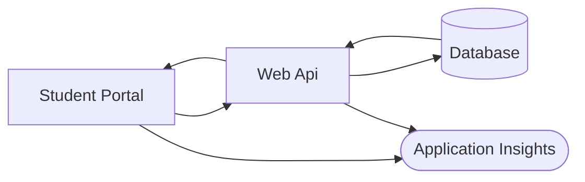
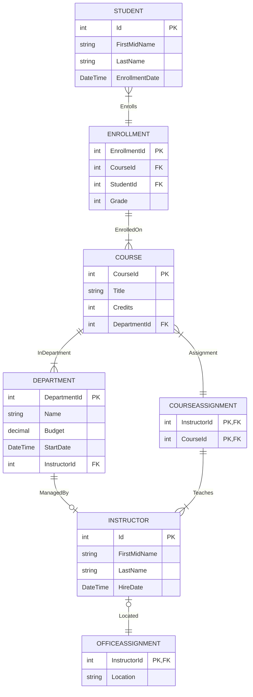

# TFL DevOps Technical Skills Assessment

**Time Limit:** 60 minutes  
**Total Questions:** 3

## Introduction

Welcome to the TFL DevOps Technical Skills Assessment. This is a **60-minute practical assessment** designed to evaluate your problem-solving abilities in a realistic production support scenario.

### The System
You'll be working with a school management system consisting of:
- **ASP.NET Core Web API** - RESTful service layer
- **Razor Pages Student Portal** - Web frontend
- **Azure SQL Database** - Data persistence
- **Application Insights** - Monitoring and diagnostics
- **PowerShell Scripts** - Automation and data management

### Assessment Format
- **Duration:** 60 minutes
- **Questions:** 3 independent scenarios
- **Recommended Time:** 20 minutes per question
- **Open Resources:** You may use documentation, search engines, and development tools
- **Environment:** Browser-only workflow using `vscode.dev`, Azure Portal, and GitHub

**Important:** Focus on demonstrating your diagnostic approach and problem-solving methodology. Clear communication of your thought process is valued.

## System Architecture

## Database Schema

---

## Question 1: Diagnose and Resolve Production API Outage (20 minutes)

### Incident Report
**Priority:** P1 - Production Down  
**Status:** The Web API is returning 500 errors and cannot serve requests  
**Last Known Good:** 2 hours ago  
**Recent Changes:** Configuration update deployed to production  

The operations team has Application Insights configured for this service.

### Your Task
The API service has failed after a recent configuration deployment. You need to:

1. **Investigate telemetry first** using Application Insights (failures, traces, and request outcomes) to understand what is failing and why
2. **Identify** the root cause from observable evidence in logs and configuration
3. **Implement** a targeted fix in the repository using `vscode.dev`
4. **Commit and push** your change so the deployment pipeline can redeploy the service
5. **Validate recovery** in Azure by confirming the API returns healthy responses and the error pattern is resolved

---

## Question 2: Resolve Student Portal Data Accuracy Issue (20 minutes)

### Bug Report
**Reported By:** Academic Affairs Department  
**Severity:** High  
**Impact:** Student records displaying incorrect credit totals, affecting graduation audits

**Description:**  
The Student Portal is calculating student credit totals incorrectly. Multiple students are showing credit values that don't match their course enrollments.

**Reproduction:**
1. Navigate to the Student Portal
2. Search for student: `Carson Alexander`
3. Expected total credits: `9`
4. Actual total credits: `3`

### Your Task
This is a data calculation bug affecting all student records in the portal.

1. **Understand the raised defect** and expected behavior from the bug report
2. **Locate** the source of the incorrect calculation in the code
3. **Fix** the business logic error using `vscode.dev`
4. **Commit and push** directly to trigger redeployment (do not rely on local build/test)
5. **Verify** the deployed portal now shows correct totals and handles edge cases properly

### Testing Your Fix
Use the deployed Student Portal URL and API endpoints provided by your interviewer.
Validate in the live environment after your commit is redeployed.

For the reported case, searching for `Carson Alexander` should show total credits of `9` after your fix.

---

## Question 3: Critical Data Migration Script Failure (20 minutes)

### Incident Report
**Priority:** P2 - Data Integrity Issue  
**System:** Annual Student Enrollment Data Upload  
**Impact:** 0 of 200+ new students were imported into the production database

**Background:**  
The automated enrollment process that imports new students from CSV files has failed. The run is throwing an error that the student transaction was rolled back due to row count mismatch. This is blocking the start of the academic year.

### Your Task
The data load process now runs through the Azure Function App (`DataUpload.FunctionApp/RunEnrollmentUpload/run.ps1`) and uses CSV inputs from `DataUpload/Enrollment2024/`.

1. **Analyze** the Function App upload logic to identify why only partial data is being processed
2. **Correct** the data processing logic
3. **Implement** proper input sanitization for SQL safety
4. **Commit and push** your fix to trigger workflow `Build and Deploy Data Upload Function`
5. **Run** workflow `Upload Data Files and Run Data Upload Function` to upload CSV files and invoke the function
6. **Validate** execution output in GitHub Actions logs and Azure monitoring to confirm all expected records were processed

### Expected Outcome
Your fix should result in all records from `Students.csv` being inserted successfully, no transaction rollback, proper escaping of special characters (for example apostrophes), and successful row-count validation.

### Testing Your Fix
Do not execute the process locally.

Use workflow `Build and Deploy Data Upload Function` first to deploy your function code changes.
Then run workflow `Upload Data Files and Run Data Upload Function` to upload `Students.csv` and `Enrollments.csv` to the Function App and trigger `RunEnrollmentUpload`.

If student insert row-count validation fails, the student transaction is rolled back and the function returns an error. In that case, processing stops and enrollment upload does not continue.

After the workflow run, use workflow logs and Azure monitoring output to confirm either successful completion or a rollback failure.

**Note:** Consider how PowerShell handles variable scope and string concatenation in loops.
